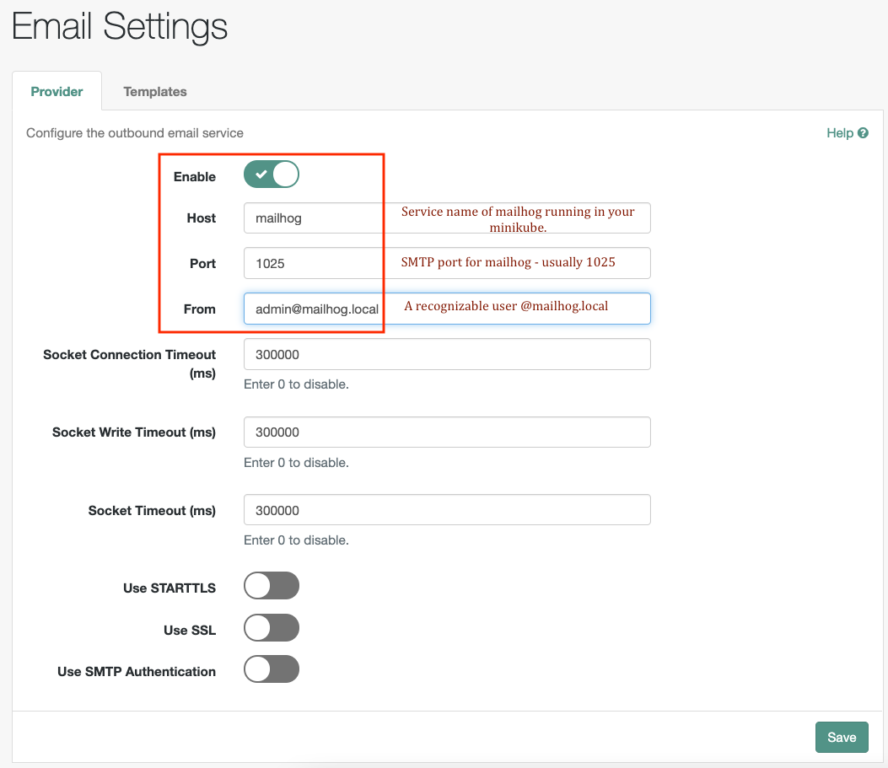
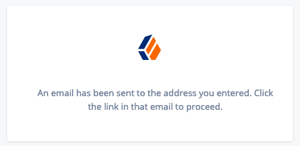
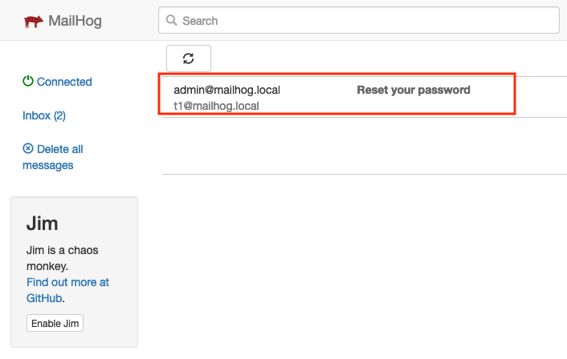
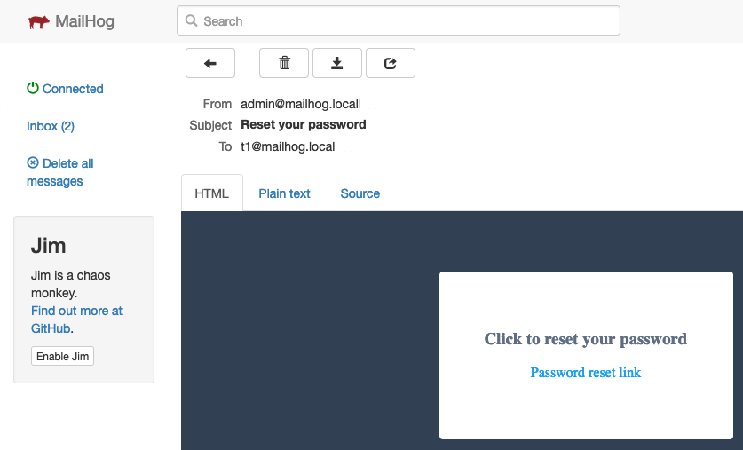
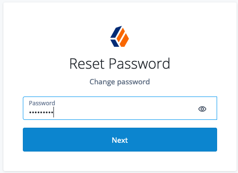
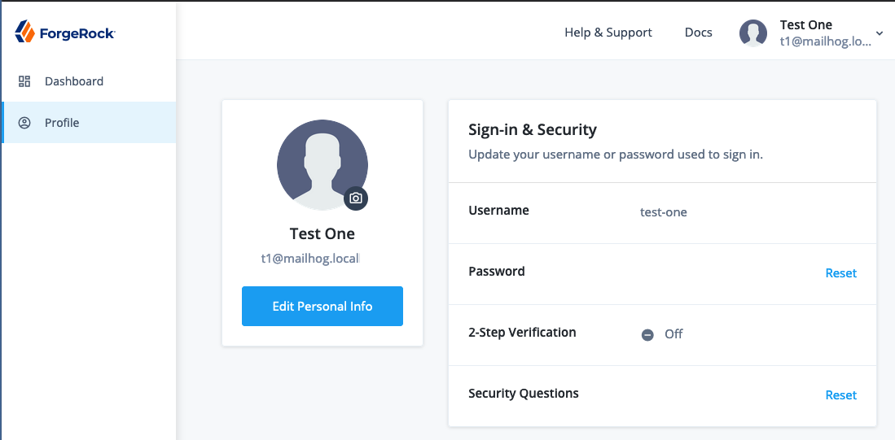

# Deploying Mailhog in Minikube 

## Introduction

Mailhog is a lightweight utility for sending and viewing email messages in a 
Kubernetes cluster, especially in a development environment. It is easily used 
for testing purposes. You can use Mailhog to:
* Test SMTP email delivery 
* View received email messages using the web UI
* Optionally integrate with an SMTP server for email delivery

**Note**: **This is not meant for use in production environments**. 
ForgeRock does not guarantee the individual success developers may have in 
implementing the code on their development platforms.

## References

* [Mailhog deployment guide](https://artifacthub.io/packages/helm/codecentric/mailhog)
* [Mailhog documentation on Github](https://github.com/mailhog/MailHog/tree/master/docs)

## Set up Mailhog in your Kubernetes cluster

### Prerequisites:
1. You have set up the CDK.
1. You have installed Helm.
1. Your Kubernetes context is set to your cluster.
1. You have enabled SMTP (such as Postfix) in your host system so you can test SMTP message delivery from your local machine.

### Deploying Mailhog

1. Set up your Kubernetes context and namespace, for example:

    ```
    kubectx minikube

    kubens my-namespace
    ```
1.  Install Mailhog in your namespace using Helm:

    ```
    helm repo add codecentric https://codecentric.github.io/helm-charts
    
    helm install mailhog codecentric/mailhog 
    ```

1. Verify that the Mailhog pod is running:

    ```
    kubectl get pods | grep mailhog
    mailhog-16...zl   1/1     Running     1          23m
    ```

1. In a terminal window, set up port forwarding for SMTP (port 1025), to verify that test messages are delivered:

    ```
    export POD_NAME=mailhog-16...zl

    kubectl port-forward --namespace my-namespace $POD_NAME 1025
    ```
 
1. In another terminal window, set up port forwarding for HTTP view (port 8025) to view the emails on the Mailhog server:

    ```
    export POD_NAME=mailhog-16...zl

    kubectl port-forward --namespace my-namespace $POD_NAME 8025
    ```

1. Verify that you are able to send and view emails using local Mailhog server:

    1. Open a new browser window, and access the HTTP port of the  Mailhog server 
    pod, for example: my-namespace.iam.example.com:8025. 
    
    1. In a separate terminal window, run the following command:
        ```
        date | mail -s "Test Email" test@mailhog.local
        ```

    1. Notice that the message you sent appears in the Mailhog HTTP interface.   
    
## Enable the email service in IDM

After verifying that the Mailhog server is able to send and receive messages, you 
can configure email settings in the IDM server.

1. Log in to the IDM administration console and configure email settings. 


## Test resetting a user's password

1. In a web browser, access the reset password  service in your deployment, <br/> for example: https://my-namespace.iam.example.com/am/?service=ResetPassword 

1. Enter the email ID of the user whose password needs to be reset - for example  the email ID for our test user is `t1@mailhog.local`.

1. A notification appears indicating that the password reset email has been sent.


1. View your Mailhog inbox to see if you have received the email to reset password.
 

1. Open the reset password email and click the `Reset Password link`.


1. Enter the new password.<br/>


1. Verify that you can log in after you have reset the password.
.

 There you have it, a simple but effective way of setting up and testing reset 
 password in a development environment.  